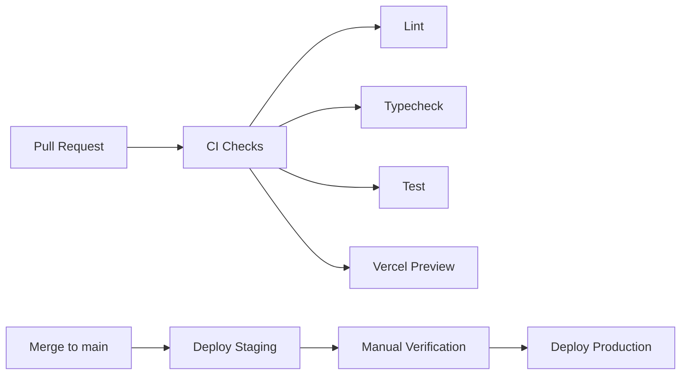

# Deployment — Atlas Sales OS

**Version:** 1.0  
**Status:** Accepted  
**Last Updated:** 2026-07-17

---

## Overview

Atlas Sales OS deploys across three managed platforms:

| Component | Platform | Deploy Method |
|-----------|----------|---------------|
| Web app (`apps/web`) | Vercel | Git push / CLI |
| Background worker (`apps/worker`) | Trigger.dev Cloud | CLI / CI |
| Database & Auth | Supabase | Migrations via CLI |
| Edge Functions | Supabase | CLI |
| File storage | Supabase Storage | Managed |

---

## Environments

| Environment | Purpose | Supabase | Vercel | Trigger.dev |
|-------------|---------|----------|--------|-------------|
| **Local** | Development | Local (Docker) | `pnpm dev` | Dev server |
| **Preview** | PR review | Staging project | Auto on PR | Dev environment |
| **Staging** | Pre-production testing | Staging project | Manual / milestone merge | Staging environment |
| **Production** | Live system | Production project | Manual approval | Production environment |

### Environment Isolation

- Separate Supabase projects for staging and production
- Separate API keys per environment
- Separate Trigger.dev environments
- No production data in non-production environments
- Staging uses seed data only

---

## CI/CD Pipeline

Configured during Milestone 0:



### CI Workflow (`.github/workflows/ci.yml`)

Triggered on: pull request to `main` or milestone branches

| Step | Command | Failure Action |
|------|---------|----------------|
| Install | `pnpm install --frozen-lockfile` | Block merge |
| Lint | `pnpm lint` | Block merge |
| Typecheck | `pnpm typecheck` | Block merge |
| Test | `pnpm test` | Block merge |
| Build | `pnpm build` | Block merge |

### Preview Deployment

Triggered on: pull request

- Vercel automatically deploys preview
- Preview URL posted as PR comment
- Uses staging Supabase project
- Uses Trigger.dev dev environment

### Staging Deployment

Triggered on: merge to milestone branch or manual

- Deploy web app to Vercel staging
- Deploy worker to Trigger.dev staging
- Run database migrations against staging Supabase

### Production Deployment

Triggered on: manual approval after staging verification

- Deploy web app to Vercel production
- Deploy worker to Trigger.dev production
- Run database migrations against production Supabase
- Post-deploy smoke test

---

## Database Migrations

### Workflow

```bash
# Create migration
pnpm supabase migration new description

# Apply locally
pnpm supabase db push

# Apply to staging (via CI or manual)
pnpm supabase db push --linked

# Generate TypeScript types
pnpm supabase gen types typescript --local > packages/database/src/types.ts
```

### Migration Rules

| Rule | Detail |
|------|--------|
| Forward-only | Never edit applied migrations; create new ones |
| Test locally first | Always apply to local Supabase before staging |
| Staging before production | Always apply to staging before production |
| RLS included | RLS policies in same migration as table creation |
| Rollback plan | Document rollback SQL in migration comments for destructive changes |
| Backup before production | Supabase auto-backup; verify before major migrations |

---

## Worker Deployment

Trigger.dev workers deploy separately from the web app:

```bash
# Deploy to staging
pnpm --filter worker deploy:staging

# Deploy to production
pnpm --filter worker deploy:production
```

Worker deployment is included in the CI pipeline after M0.

---

## Environment Variables

### Management

| Environment | Storage |
|-------------|---------|
| Local | `.env.local` (gitignored) |
| Preview | Vercel preview env vars |
| Staging | Vercel + Supabase + Trigger.dev dashboards |
| Production | Vercel + Supabase + Trigger.dev dashboards |

### Required Variables

Documented in `.env.example` (created in M0). Categories:

| Category | Variables | Environments |
|----------|-----------|-------------|
| Supabase | `NEXT_PUBLIC_SUPABASE_URL`, `NEXT_PUBLIC_SUPABASE_ANON_KEY`, `SUPABASE_SERVICE_ROLE_KEY` | All |
| AI | `OPENAI_API_KEY`, `GEMINI_API_KEY` | Staging, Production |
| Email | `RESEND_API_KEY` | Staging, Production |
| Trigger.dev | `TRIGGER_SECRET_KEY` | All |
| App | `NEXT_PUBLIC_APP_URL` | All |

### Secret Rotation

- Rotate secrets immediately if compromised
- API keys rotated quarterly (production)
- Document rotation procedure in runbook (M9)

---

## Domain & DNS

| Domain | Purpose | Managed By |
|--------|---------|------------|
| `app.atlas-sales.com` (example) | Web application | Vercel |
| `outreach.clientdomain.com` | Outbound email sending | Client DNS + platform |
| `notifications.atlas-sales.com` | Transactional email (Resend) | Resend |

Outreach domains are client-managed with platform-provided DNS instructions (M4).

---

## Monitoring (M9)

| Metric | Tool | Alert Threshold |
|--------|------|-----------------|
| Web app uptime | Vercel Analytics | < 99.5% |
| API error rate | Vercel / custom | > 1% of requests |
| Database connections | Supabase Dashboard | > 80% of limit |
| Job failure rate | Trigger.dev Dashboard | > 5% of jobs |
| Email bounce rate | Platform dashboard | > 2% |
| Email spam rate | Platform dashboard | > 0.1% |

---

## Rollback Procedure

### Web App

Vercel supports instant rollback to any previous deployment via dashboard or CLI.

### Worker

Trigger.dev supports version rollback via dashboard.

### Database

- Forward-only migrations; rollback requires manual SQL
- Destructive migrations must include rollback SQL in comments
- Supabase point-in-time recovery for disaster scenarios

---

## Related Documents

- [Development Workflow](../development/workflow.md)
- [Git Strategy](../development/git-strategy.md)
- [Environment Setup](../development/environment-setup.md)
- [Milestone Plan](../milestones/milestone-plan.md)
