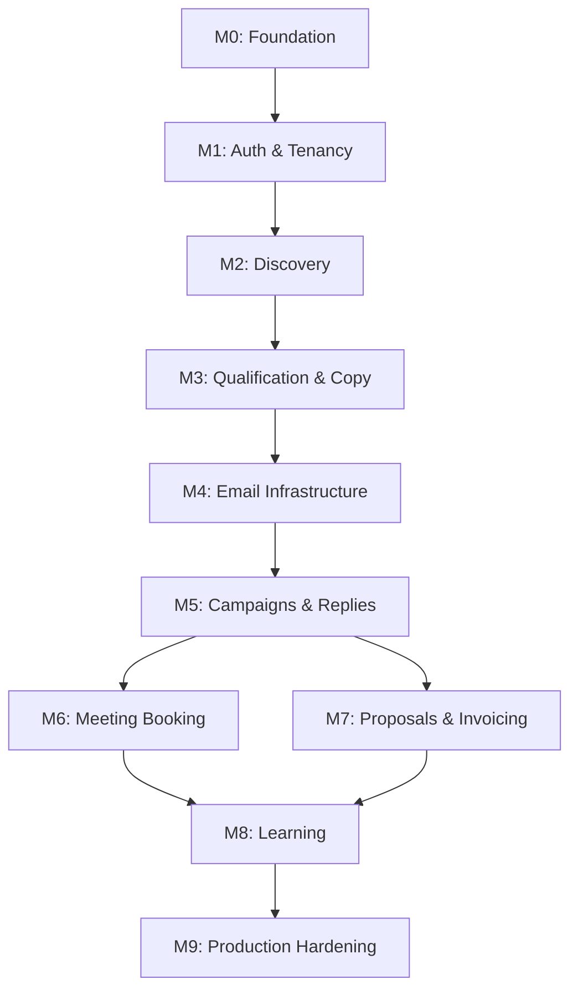

# Product Roadmap — Atlas Sales OS

**Version:** 1.0  
**Status:** Accepted  
**Last Updated:** 2026-07-17  
**Horizon:** 18–24 months

---

## Roadmap Philosophy

This roadmap describes **capabilities**, not sprints. Delivery is organized into [milestones](../milestones/milestone-plan.md) that each produce a deployable increment. Dates are intentionally omitted until velocity is established in Milestone 0–1.

We ship **working software** at every milestone. No "foundation only" phases that deliver nothing usable.

---

## Capability Timeline

```
Phase 1: Foundation          Phase 2: Outbound Engine       Phase 3: Conversion        Phase 4: Intelligence
─────────────────────        ─────────────────────────      ───────────────────        ────────────────────
M0  Project foundation       M4  Email infrastructure       M6  Meeting booking       M8  Learning & optimization
M1  Auth & tenancy           M5  Campaigns & replies        M7  Proposals & invoices  M9  Production hardening
M2  Discovery pipeline       │                              │
M3  Qualification & copy     │                              │
                             └──────────────────────────────┘
```

---

## Phase 1: Foundation (Milestones 0–1)

**Goal:** Establish a secure, multi-tenant platform skeleton that Atlas Solutions can log into and configure.

| Capability | Milestone | Description |
|------------|-----------|-------------|
| Repository & CI/CD | M0 | Monorepo, linting, testing, deployment pipeline |
| Authentication | M1 | Supabase Auth, session management, protected routes |
| Multi-tenancy | M1 | Organization/workspace isolation at DB and API level |
| Core data model | M1 | Companies, contacts, campaigns, users, audit logs |
| Admin dashboard shell | M1 | Navigation, settings, empty states for future modules |
| Audit logging | M1 | Immutable event log for compliance foundation |

**Exit criteria:** A user can sign up, create an organization, invite team members, and see an empty dashboard ready for campaign configuration.

---

## Phase 2: Outbound Engine (Milestones 2–5)

**Goal:** End-to-end outbound from discovery to sent email with reply tracking.

### M2 — Discovery & Research Pipeline

| Capability | Description |
|------------|-------------|
| ICP configuration | Define target company criteria (industry, size, geography, tech stack, etc.) |
| Company discovery | Find companies matching ICP via configured sources |
| Website crawling | Responsible public website extraction (Firecrawl + Playwright) |
| Company research | AI analysis of branding, UX, positioning, and pain points |
| Contact discovery | Find publicly available business contact information |
| Research dashboard | View company profiles with AI-generated insights |

### M3 — Qualification & Outreach Generation

| Capability | Description |
|------------|-------------|
| Lead scoring | Configurable qualification rules + AI scoring |
| Approval workflows | Human review gates before outreach (configurable) |
| Email generation | Personalized outreach from research context |
| Sequence design | Multi-step email sequences with timing rules |
| Template management | Base templates with AI personalization layers |
| Quality checks | Pre-send validation (spam triggers, missing unsubscribe, etc.) |

### M4 — Email Infrastructure

| Capability | Description |
|------------|-------------|
| Domain management | Dedicated outreach domains with DNS guidance |
| SPF/DKIM/DMARC | Configuration tracking and validation |
| Mailbox management | Google Workspace / SMTP mailbox registration |
| Warm-up | Mailbox warm-up scheduling and monitoring |
| Sending limits | Per-mailbox and per-domain daily limits |
| Mailbox rotation | Distribute sends across mailboxes |
| Suppression lists | Global and per-campaign suppression |
| Bounce monitoring | Hard/soft bounce detection and handling |
| Unsubscribe handling | Automatic unsubscribe link processing |
| Deliverability dashboard | Mailbox health scores, reputation metrics |

### M5 — Campaigns & Reply Detection

| Capability | Description |
|------------|-------------|
| Campaign execution | Launch, pause, resume campaigns |
| Send scheduling | Timezone-aware send windows |
| Reply detection | Parse inbox for replies; classify intent |
| Follow-up automation | Auto-advance or pause sequences on reply |
| Campaign analytics | Open, reply, bounce, meeting rates |
| Notification system | Alert humans for replies, approvals, anomalies |
| Campaign auto-pause | Pause on deliverability degradation |

**Exit criteria:** A user can configure an ICP, discover companies, generate personalized outreach, send a campaign, and see replies detected automatically.

---

## Phase 3: Conversion (Milestones 6–7)

**Goal:** Convert engaged leads into booked meetings and closed deals.

### M6 — Meeting Booking

| Capability | Description |
|------------|-------------|
| Calendar integration | Connect operator calendars |
| Availability management | Define bookable slots |
| Meeting links | Generate and embed booking links in emails |
| Booking confirmation | Auto-confirm and notify both parties |
| Pre-meeting brief | AI-generated briefing doc from research + reply history |

### M7 — Proposals & Invoicing

| Capability | Description |
|------------|-------------|
| Proposal generation | AI-generated proposals from meeting context |
| Proposal approval | Human approval gate before sending |
| Proposal delivery | Send proposals via email with tracking |
| Invoice generation | Generate invoices from approved proposals |
| Payment tracking | Track invoice status (manual initially) |
| Client onboarding | Trigger onboarding workflow on deal close |

**Exit criteria:** A lead can reply, book a meeting, receive an approved proposal, and enter onboarding—all within the platform.

---

## Phase 4: Intelligence & Scale (Milestones 8–9)

**Goal:** The platform improves itself and operates reliably at scale.

### M8 — Learning & Optimization

| Capability | Description |
|------------|-------------|
| Campaign analytics | Deep performance analysis across campaigns |
| A/B testing | Test subject lines, copy variants, send times |
| ICP refinement | Recommend ICP adjustments from outcomes |
| Copy optimization | Learn which messaging patterns convert |
| Send time optimization | Learn optimal send windows per segment |
| Feedback loops | Incorporate human edits into future generation |

### M9 — Production Hardening

| Capability | Description |
|------------|-------------|
| Performance optimization | Query optimization, caching, edge deployment |
| Security audit | Penetration testing, dependency audit |
| Monitoring & alerting | Uptime, error rates, deliverability alerts |
| Disaster recovery | Backup strategy, failover procedures |
| Documentation | Operator guides, API docs, runbooks |
| Commercial readiness | Billing hooks, usage metering (if externalizing) |

**Exit criteria:** Platform operates reliably with measurable self-improvement and is ready for commercial deployment if desired.

---

## Future Considerations (Post-Roadmap)

These are explicitly **not** scheduled. Evaluate after M9 based on business need:

| Capability | Notes |
|------------|-------|
| CRM integration | Sync with HubSpot/Salesforce for deal tracking |
| LinkedIn outreach | High compliance risk; evaluate carefully |
| Phone/SMS channels | Requires separate deliverability and compliance framework |
| White-label SaaS | Multi-brand deployment for external customers |
| Marketplace / integrations | Third-party data sources, enrichment APIs |
| Mobile app | Operator notifications and approvals on mobile |

---

## Dependencies Between Phases



M6 and M7 can proceed in parallel after M5. M8 requires data from M5–M7.

---

## Roadmap Review Cadence

- **After each milestone:** Review remaining roadmap items; adjust priorities based on learnings.
- **Quarterly:** Stakeholder review of Phase timeline and commercial readiness.
- **On scope change:** Update charter, roadmap, and milestone plan together.

---

## Related Documents

- [Product Charter](./charter.md)
- [Milestone Plan](../milestones/milestone-plan.md)
- [Architecture Overview](../architecture/overview.md)
